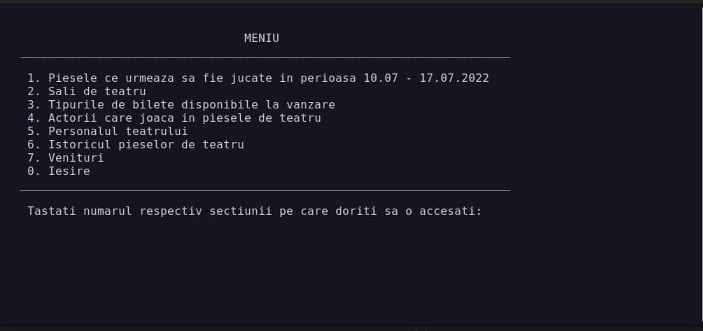

# Highschool project - Theatre data base simulation
- This project was created by me and two other students from [Colegiul National Bilingv George Cosbuc](http://cosbucbilingv.ro/). 
- We have created a data storage system that makes use of files as its foundation. To represent the information from these files, we've developed several data structures.
- The program we've built runs on a console interface, presenting users with a Main Menu that grants access to various sub-menus. These sub-menus serve to modify the data stored within the files.

- Our choice of a static memory management system means that it isn't capable of adapting in real-time.
# Installation
- Before running the program, make sure that you have a compiler installed on your machine. One option is to use [MinGW](https://www.mingw-w64.org/downloads/).
- To run the program, you'll first need to open the Project_Files folder, which is located within the repository, in the terminal. From there, you can run the program using a set of commands that should get it up and running in no time.
~~~
$ g++ -o main main.cpp
$ ./main
~~~
# Requirements
- This application is compatible with both **Windows** and **Linux** operating systems.

# Project Status
- The project has been completed on the 10th of January 2023.

